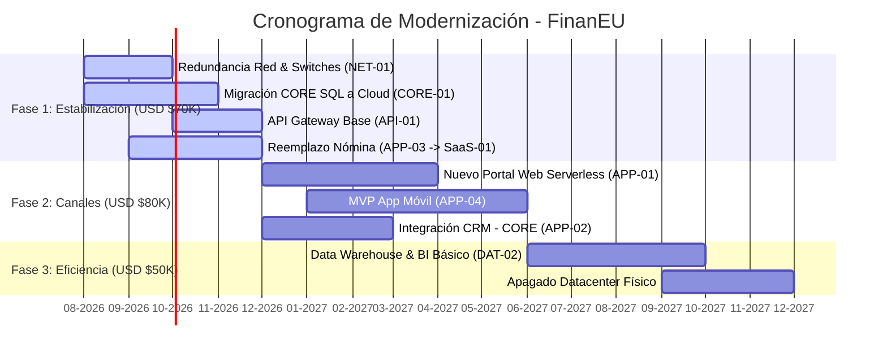

# Plan Estratégico de Modernización Tecnológica - FinanEU

Este plan de modernización tecnológica establece la hoja de ruta para la cooperativa **FinanEU** a 18 meses, diseñado bajo estrictas restricciones de presupuesto (**USD $200,000**) y capacidad de equipo (**8 personas**). Su objetivo es resolver la deuda técnica crítica y las integraciones de alto riesgo identificadas en el **Mapa de Arquitectura Actual (As-Is)**, garantizar el cumplimiento regulatorio antes de diciembre y habilitar canales digitales para competir en el mercado.

---

## 1. Criterios de Priorización (¿Qué modernizamos primero y por qué?)

La priorización de los componentes se basa en una matriz de **Mitigación de Riesgo Catastrófico y Cumplimiento Regulatorio** frente a **Generación de Valor Comercial**.

```
    ALTO | ---------------------------------------------------------------------
         | [1. Estabilización de Infraestructura]    [2. Canales y Crecimiento]
         | (NET-01 Redundancia, CORE-01 DB Cloud,     (APP-01 Portal, APP-04 App
Riesgo / |  API-01 Gateway, SaaS-01 Nómina)           MVP, API CRM-CORE)
Impacto  |
         |                                           [3. Eficiencia y Analítica]
         |                                            (DAT-02 BI/DWH, Apagado DC)
    BAJO | ---------------------------------------------------------------------
         |                      BAJO                                 ALTO
                                  Retorno / Valor de Negocio
```

### Criterio de Priorización
1. **Fase 1: Estabilización y Cumplimiento Regulatorio (Meses 0-6 / Foco Técnico y Legal):**
   * **Por qué:** La Entidad de Vigilancia Financiera exige el cumplimiento de estándares de ciberseguridad y disponibilidad antes de diciembre de este año. Los componentes más críticos y vulnerables de la arquitectura actual son **CORE-01 (CORE Financiero — SistemaCoop)** en SQL Server 2008 (sin parches desde 2021) y **APP-03 (NominaSoft)** en Windows Server 2008 R2 (sin soporte y dependiente de una sola persona). Además, **NET-01 (Red y Conectividad)** carece de redundancia en el enlace WAN y sus switches Cisco no tienen soporte.
   * **Acciones:** Asegurar la red (**NET-01**), aislar y migrar el motor de base de datos de **CORE-01** a una plataforma administrada, implementar el API Gateway (**API-01**) y reemplazar **APP-03 (NominaSoft)** con un **SaaS-01** en la nube.
2. **Fase 2: Canales Digitales y Crecimiento Comercial (Meses 6-12 / Foco Negocio):**
   * **Por qué:** El área comercial reporta un 35% de abandono en solicitudes de crédito online porque el portal actual (**APP-01**) es lento y se cae frecuentemente en quincena. Asimismo, un competidor digital está captando asociados jóvenes con una App Móvil que FinanEU no posee (**CH-02 asociados**). Por otro lado, la falta de integración de **APP-02 (CRM)** con **CORE-01** obliga a los asesores (**CH-01**) a duplicar datos manualmente.
   * **Acciones:** Reconstruir **APP-01** en una arquitectura serverless elástica, lanzar el MVP de la App Móvil (**APP-04**) e integrar **APP-02 (CRM)** con **CORE-01** a través de **API-01**, eliminando el flujo manual de doble digitación.
3. **Fase 3: Eficiencia Operativa y Analítica (Meses 12-18 / Foco Optimización):**
   * **Por qué:** El proceso de reportería gerencial actual (**DAT-01**) se realiza con macros de Excel que consultan directamente la base de datos de producción de **CORE-01**, provocando bloqueos y degradación en el sistema, tardando hasta 3 días al mes.
   * **Acciones:** Implementar un Data Warehouse básico y BI (**DAT-02**) alimentado por réplicas de lectura de la base de datos, eliminando las macros de producción, y realizar el apagado (decommissioning) definitivo del datacenter físico local.

---

## 2. Patrón Arquitectónico Propuesto para Componentes Críticos

Proponemos un **Enfoque Híbrido Pragmático**: **Monolito Modular** para el CORE y **Serverless / Cloud-Native** para los canales digitales y capas de integración.

```mermaid
graph TD
    subgraph Capa 1: Canales y Usuarios (Modernizada)
        CH01["CH-01: Asesores / Empleados (Acceso Seguro)"]
        CH02["CH-02: Asociados (Portal Web + App)"]
    end

    subgraph Capa 2: Aplicaciones de Canal (Cloud-Native / Serverless)
        APP01["APP-01: Portal Web (Reconstruido Serverless)"]
        APP04["APP-04: App Móvil (MVP Asociados Jóvenes)"]
        APP02["APP-02: CRM Comercial (Integrado via API)"]
    end

    subgraph Capa de Integración y Seguridad (Nueva)
        API01["API-01: API Gateway (Seguridad y Desacoplamiento)"]
    end

    subgraph Capa 3: Datacenter & CORE (Migrado a Cloud)
        CORE01["CORE-01: CORE Financiero - SistemaCoop (SQL Server en Nube Administrada - Monolito Modular)"]
        DAT02["DAT-02: Data Warehouse & BI (Sustituye DAT-01)"]
    end

    subgraph Servicios Externos SaaS
        SaaS01["SaaS-01: Nómina SaaS Cloud (Reemplaza APP-03 NominaSoft)"]
    end

    %% Flujos e Integraciones
    CH02 --> |Acceso Seguro| APP01
    CH02 --> |Acceso Seguro| APP04
    CH01 --> |Operaciones| APP02
    
    APP01 --> |Consultas/Transacciones - HTTPS| API01
    APP04 --> |Consultas/Transacciones - HTTPS| API01
    APP02 --> |Sincronización Clientes - HTTPS| API01
    
    API01 --> |APIs Seguras / Strangler Fig| CORE01
    CORE01 --> |Réplica de Lectura Segura| DAT02
    
    classDef estable fill:#e6f4ea,stroke:#137333,stroke-width:2px;
    class APP01,APP02,APP04,API01,CORE01,DAT02,SaaS01 estable;
```

### Justificación Técnica y Operativa de la Arquitectura

| Componente de Destino | Patrón Propuesto | Justificación Frente al As-Is |
| :--- | :--- | :--- |
| **CORE-01 (SistemaCoop)** | **Monolito Modular** (Desacoplado) | **Por qué no Microservicios:** Con solo 2 desarrolladores y 1 DBA en el equipo de TI, el overhead operativo de microservicios (latencia de red, consistencia eventual, Saga patterns, DevOps complejo) colapsaría al equipo.<br>**Por qué Monolito Modular:** Permite mantener la lógica de negocio centralizada en una única base de datos estructurada en la nube, pero separando lógicamente los módulos (Cartera, Ahorro, Contabilidad) para evitar código espagueti y facilitar la transición futura, mientras se desacopla del resto mediante el **API-01 Gateway**. |
| **APP-01 (Portal Web) y APP-04 (App Móvil)** | **Serverless (FaaS / Containers)** | **Escalabilidad Elástica:** **APP-01** sufre caídas constantes en quincena. Arquitecturas Serverless (e.g., AWS Lambda / Google Cloud Run) escalan automáticamente a cero ante inactividad y absorben picos de demanda en paydays de forma elástica, sin necesidad de administrar servidores virtuales para el único recurso de infraestructura del equipo. |
| **API-01 (API Gateway)** | **Capa de Abstracción / Middleware** | Actúa como fachada de seguridad y traducción de protocolos. Protege a **CORE-01** de accesos directos, expone servicios mediante REST/GraphQL y valida autenticación de forma centralizada (mitigando riesgos de ciberseguridad exigidos por el ente regulador). |

---

## 3. Resolución de Integraciones de Alto Riesgo e Inexistencia de Soporte

El plan de modernización resuelve directamente los cuellos de botella e integraciones inseguras identificados en la Capa 3 del mapa As-Is:

| Origen (As-Is) | Destino (As-Is) | Mecanismo As-Is | Riesgo | Solución Propuesta (Modernizada) |
| :--- | :--- | :--- | :--- | :--- |
| **APP-02 CRM** | **CORE-01** | Digitación manual (humano) | **CRÍTICO** | Integración en tiempo real. **APP-02 (CRM)** se conecta vía HTTPS a **API-01 (API Gateway)** para sincronizar la información del cliente y prospectos directamente con el **CORE-01**, eliminando el trabajo manual de los asesores (**CH-01**). |
| **APP-01 Portal** | **CORE-01** | Query directo a producción | **CRÍTICO** | Desacoplamiento total. El nuevo **APP-01 (Portal Serverless)** realiza llamadas a APIs públicas expuestas por **API-01 (API Gateway)**. Se eliminan las conexiones de base de datos directas desde la web, aislando la BD de producción de la internet pública. |
| **CORE-01** | **DAT-01 Excel** | Macros / ODBC a producción | **ALTO RIESGO** | Aislamiento de reportería. Las macros de **DAT-01** se re-direccionan a una **Read Replica** (réplica de lectura en la nube) de la base de datos de **CORE-01**. En la Fase 3, se migran estos informes a una herramienta de BI centralizada sobre un Data Warehouse básico (**DAT-02**). |
| **APP-03 Nómina** | **CORE-01** | Sin integración (archivos planos) | **ALTO RIESGO** | Migración a **SaaS-01 (Nómina SaaS)**. La nómina se gestiona de forma externa. La integración contable con **CORE-01** se realiza una vez al mes a través de una API segura de **API-01** que valida la carga del asiento contable de nómina. |

### Estrategia de Mitigación de Deuda Técnica de Componentes sin Soporte

1. **CORE-01 (SistemaCoop) - SQL Server 2008:**
   Dado que el proveedor desapareció y migrar el CORE por completo supera el presupuesto y plazo de 18 meses, aplicaremos el **Patrón Strangler Fig (Higo Estrangulador)** y un **Rehost con Actualización de Plataforma**. Migraremos la base de datos a un motor de base de datos administrado compatible en la nube (e.g., Azure SQL Managed Instance o AWS RDS SQL Server) en modo de compatibilidad de base de datos (e.g., Compatibilidad 100/110) para aplicar parches de seguridad de inmediato. Toda nueva funcionalidad o consulta externa se canalizará a través del **API-01 Gateway**, estrangulando poco a poco las funcionalidades del legado.
2. **APP-03 (NominaSoft) - Windows Server 2008 R2:**
   Se reemplazará completamente por un software como servicio en la nube (**SaaS-01**). La liquidación de nómina de 1,200 empleados es un proceso estándar (commodity) y no genera valor competitivo. Su reemplazo elimina los costos de mantenimiento de infraestructura obsoleta y la alta dependencia de una sola persona de TI que conoce el software heredado.

---

## 4. Balance Operativo (Estrategia Run vs. Change)

Para evitar el colapso del equipo de 8 personas, dividiremos el esfuerzo de forma estricta y apoyaremos el proceso con un **Partner Tecnológico Externo** financiado por el presupuesto del plan.

### Estructura de Trabajo del Equipo de TI
```
                   [Director de TI]
                          |
         +----------------+----------------+
         |                                 |
 [Operación Diaria - RUN]       [Modernización - CHANGE]
   - 3 Soporte (100%)             - 2 Desarrolladores (80%)
   - 1 DBA (50%)                  - 1 DBA (50%)
   - 1 Infraestructura (50%)      - 1 Infraestructura (50%)
                                  - [Partner Externo (MSP Cloud)]
```

* **Operación Diaria (RUN):**
  * Los **3 analistas de soporte** atienden al 100% las incidencias de los usuarios y la operación de oficinas locales.
  * El **DBA** y el **especialista en infraestructura** dedican el 50% de su tiempo a mantener encendidos los servidores físicos y base de datos local mientras dure la migración.
* **Modernización (CHANGE):**
  * Los **2 desarrolladores** se enfocan en un 80% en la creación del **API-01 Gateway**, las integraciones del CRM y apoyo en el desarrollo del nuevo portal web/app.
  * El **DBA** y el **especialista en infraestructura** dedican el 50% de su tiempo a co-diseñar y supervisar la infraestructura en la nube.
* **Uso de un Partner Cloud Externo (MSP):**
  * Se destinarán **USD $40,000** del presupuesto de la Fase 1 para contratar a un proveedor de servicios gestionados de nube. Ellos ejecutarán la migración física de servidores, configuración de redes y seguridad de la nube (Landing Zone) bajo la supervisión del equipo de FinanEU.

---

## 5. Roadmap de Modernización en Fases (0-18 Meses)

El presupuesto total de **USD $200,000** se distribuye estratégicamente en tres fases consecutivas:

### Tabla de Fases y Presupuesto

| Fase | Foco Principal | Iniciativas Clave | Entregables Tecnológicos | Presupuesto (USD) |
| :--- | :--- | :--- | :--- | :--- |
| **Fase 1<br>(Corto Plazo:<br>0-6 Meses)** | **Cumplimiento Regulatorio<br>y Estabilización** | 1. Redundancia de internet (fibra dual) y switches críticos (**NET-01**).<br>2. Migración del CORE SQL Server (**CORE-01**) a nube administrada compatible.<br>3. Implementación de **API-01 Gateway** para desacoplar el CORE.<br>4. Reemplazo de **APP-03** por **SaaS-01** de nómina. | * Redundancia de red local operativa.<br>* CORE en la nube con soporte de seguridad y parches.<br>* API Gateway en producción para desacoplamiento.<br>* Contrato y migración de nómina finalizados. | **$70,000**<br>*(Hardware de red, Licencias SaaS iniciales, Servicios profesionales del Partner Externo)* |
| **Fase 2<br>(Mediano Plazo:<br>6-12 Meses)** | **Canales Digitales e<br>Ingresos** | 1. Reconstrucción del Portal Web (**APP-01**) en arquitectura Serverless.<br>2. Lanzamiento del MVP de la App Móvil (**APP-04**).<br>3. Integración API de **APP-02 (CRM)** con el CORE a través de **API-01**. | * Nuevo portal web elástico y rápido.<br>* App Móvil para asociados jóvenes disponible en stores.<br>* Sincronización automática de prospectos en CRM y CORE (Cero duplicación). | **$80,000**<br>*(Desarrollo frontend, licenciamiento CRM API, costos de consumo cloud)* |
| **Fase 3<br>(Largo Plazo:<br>12-18 Meses)** | **Eficiencia y Cierre del<br>Datacenter** | 1. Data Warehouse básico (**DAT-02**) y BI para eliminar reportería manual y macros en producción (**DAT-01**).<br>2. Desmantelamiento y apagado total de servidores físicos locales. | * Dashboards gerenciales automatizados sobre réplicas de lectura.<br>* Datacenter físico apagado.<br>* Operación 100% Cloud. | **$50,000**<br>*(Herramienta de BI, arquitectura de datos en nube, costos de apagado e infraestructura de datos)* |

### Diagrama de Gantt de Modernización

